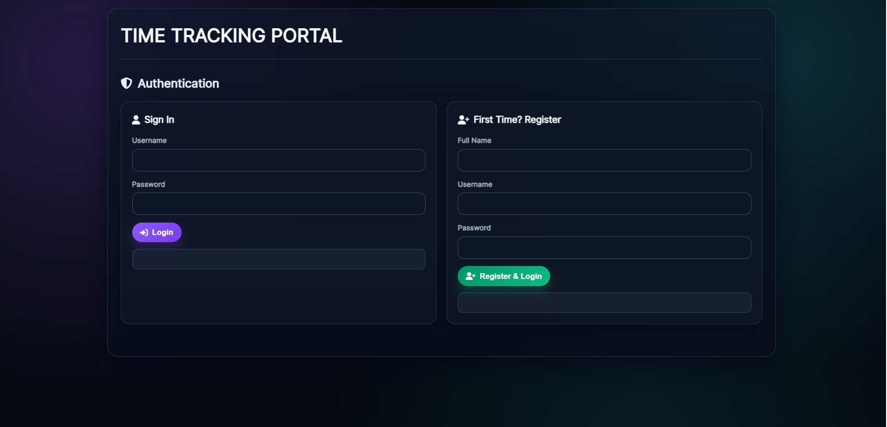
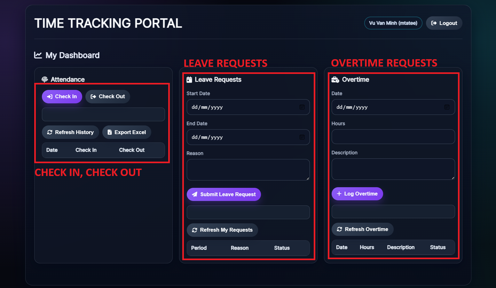
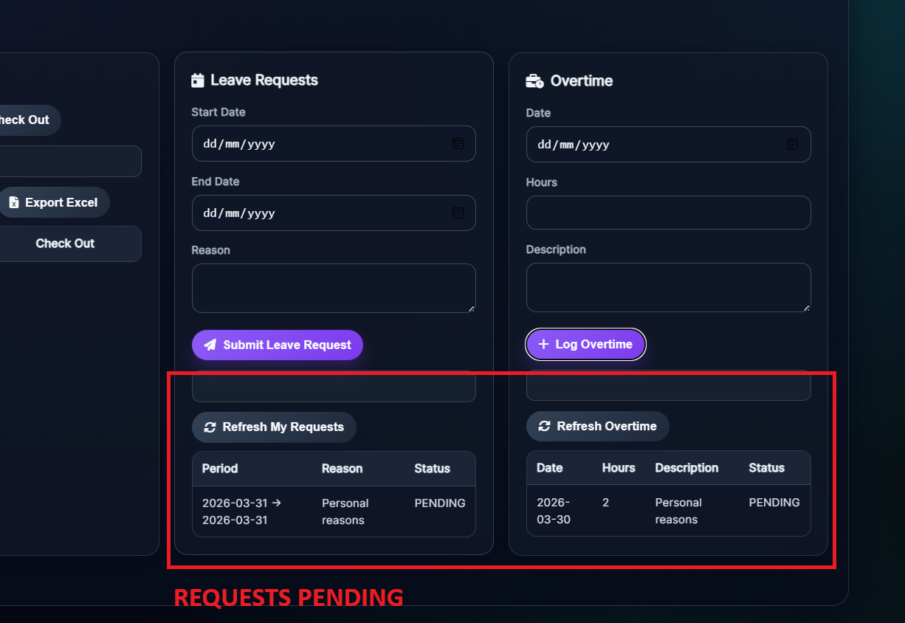
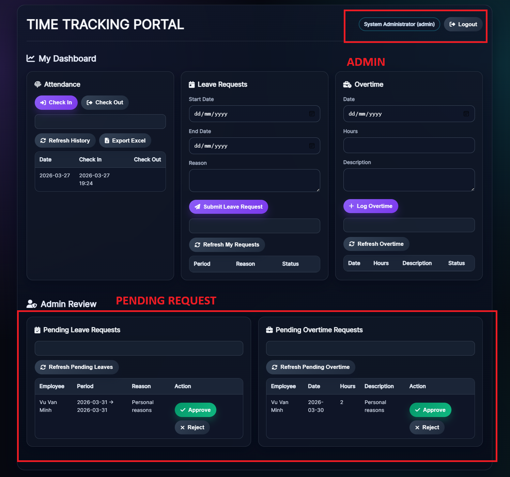

# Internal Time Tracking & Leave Logging System

Simple Spring Boot application for tracking employee check-in/check-out, leave requests, and overtime.

## User Interface Previews

### 1. Authentication Screen


### 2. Homepage


### 3. Request Pending


### 4. Admin Screen


## Tech stack

## Backend Core
Java 17: Leveraging modern features and long-term support.

Spring Boot 3.2.0: Utilizing the latest framework for high-performance microservices and web applications.

Spring Security: Implementing robust authentication and authorization.

Spring Data JPA (Hibernate): Streamlining database operations with Object-Relational Mapping (ORM).

Bean Validation: Ensuring data integrity using JSR 380 (Hibernate Validator).

## Database & Persistence
Primary Database: Microsoft SQL Server.

Secondary/Dev Database: Oracle Database.

Local Development: H2 In-memory DB (Used for rapid prototyping and unit testing).

Configuration Management: Spring Profiles (Allowing seamless switching between SQL Server, Oracle, and H2 without code changes).

## How to run

1. Make sure you have:
   - Java 17+
   - Maven 3+

2. From the project root run:

   ```bash
   mvn spring-boot:run
   ```
### SQL Server

1. Make sure a SQL Server instance is running and reachable.
2. In `src/main/resources/application-sqlserver.properties` set:
   - `spring.datasource.url`
   - `spring.datasource.username`
   - `spring.datasource.password`
3. Start the app with the `sqlserver` profile:

   ```bash
   mvn spring-boot:run -Dspring-boot.run.profiles=sqlserver
   ```
   


## Basic API overview

- `POST /api/auth/register` – register a new employee (default role `EMPLOYEE`)
- `POST /api/auth/login` – form login; send `username` and `password` as form fields; on success, a `JSESSIONID` cookie is issued
- `POST /api/auth/logout` – invalidates the current session
- `POST /api/attendance/check-in` – check-in for the current authenticated user
- `POST /api/attendance/check-out` – check-out for the current authenticated user
- `GET /api/attendance` – list attendance records for current user
- `POST /api/leaves` – create a leave request for current user
- `GET /api/leaves/me` – list leave requests for current user
- `POST /api/leaves/{id}/approve` – approve a leave request (requires role `ADMIN` or `MANAGER`)
- `POST /api/leaves/{id}/reject` – reject a leave request (requires role `ADMIN` or `MANAGER`)
- `POST /api/overtime` – log overtime for current user
- `GET /api/overtime` – list overtime records for current user

## Switching to Oracle / SQL Server

You can use Spring profiles to target Oracle or SQL Server.

### Oracle

1. Make sure an Oracle instance is running and reachable.
2. In `src/main/resources/application-oracle.properties` set:
   - `spring.datasource.url`
   - `spring.datasource.username`
   - `spring.datasource.password`
3. Start the app with the `oracle` profile:

   ```bash
   mvn spring-boot:run -Dspring-boot.run.profiles=oracle
   ```

### H2 console (optional):

   - URL: `http://localhost:8080/h2-console`
   - JDBC URL: `jdbc:h2:mem:timetrackingdb`
   - User: `sa`
   - Password: (leave empty)

The Oracle (`ojdbc11`) and H2 drivers are already declared in `pom.xml` with runtime scope.

